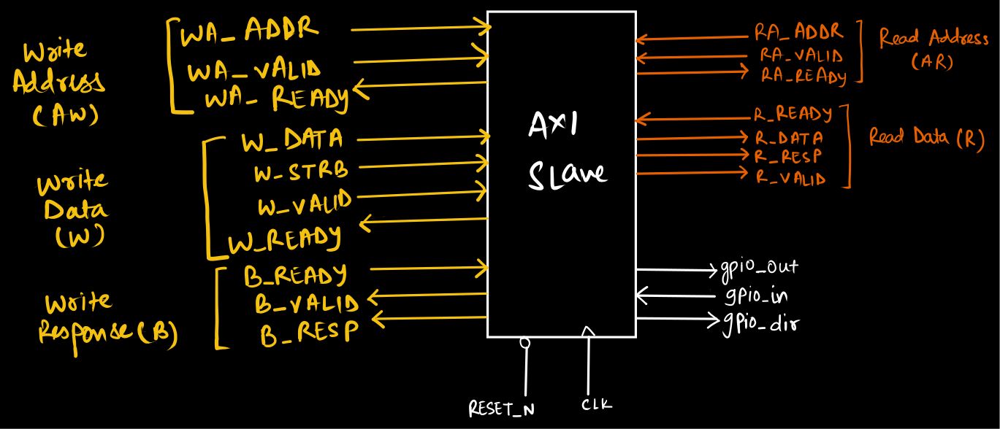
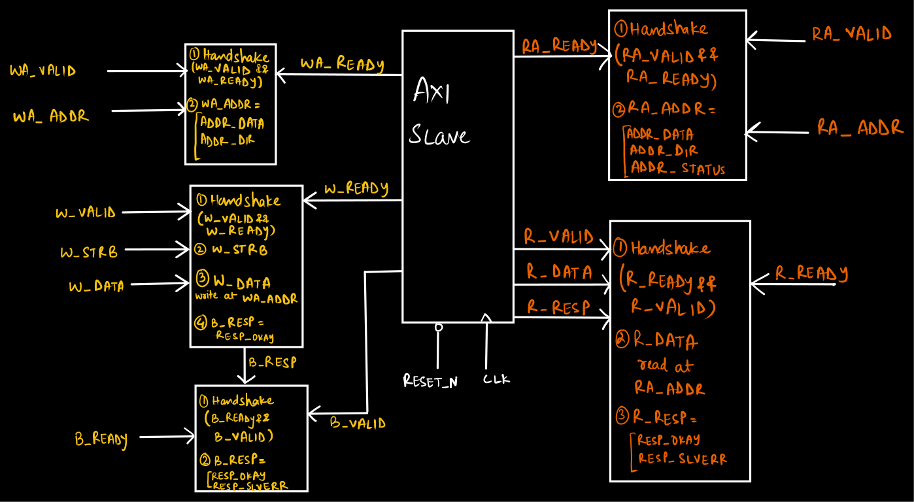

# AXI4-Lite GPIO Slave Controller

A parameterized 32-bit AXI4-Lite GPIO slave written in Verilog.

I built this project to understand AXI handshaking, independent channel behavior, memory-mapped peripheral registers, byte strobes, and protocol-oriented verification.

## Interface



The design implements the five AXI4-Lite channels:

- **WA** — Write Address
- **W** — Write Data
- **B** — Write Response
- **RA** — Read Address
- **R** — Read Data

> The RTL uses `WA_*` and `RA_*`; these correspond to the conventional AXI `AW_*` and `AR_*` channel names.

The peripheral side exposes:

- `gpio_out` — output-data register
- `gpio_dir` — direction-control register
- `gpio_in` — external GPIO input

## Memory Map

| Address | Register | Access | Function |
|---|---|---|---|
| `0x0` | DATA | R/W | Drives `gpio_out` |
| `0x4` | DIR | R/W | Drives `gpio_dir` |
| `0x8` | STATUS | R | Returns synchronized `gpio_in` |

Unsupported accesses return `SLVERR`.

## Internal Architecture



### Write Path

AXI4-Lite allows the write-address and write-data channels to arrive independently. The slave therefore captures them separately and performs the write only after both have been received.
This allows all three legal cases:

- address before data
- data before address
- address and data together
`W_STRB` is used for byte-selective writes to the DATA and DIR registers.
The generated `B_VALID`/`B_RESP` are held until:

```B_VALID && B_READY```
## Read Path

A read begins when:

`RA_VALID && RA_READY`

The address is decoded and the corresponding register value is placed on R_DATA.

The response remains valid until:

`R_VALID && R_READY`

Only one read and one write response may be outstanding at a time.

## Tools
- RTL: Verilog
- Simulation: Icarus Verilog
- Waveforms: GTKWave

## Run
```
iverilog -o axi_gpio_tb.vvp axi4_lite_gpio_slave.v axi4_lite_gpio_slave_tb.v
vvp axi_gpio_tb.vvp
gtkwave axi_gpio_tb.vcd
```
